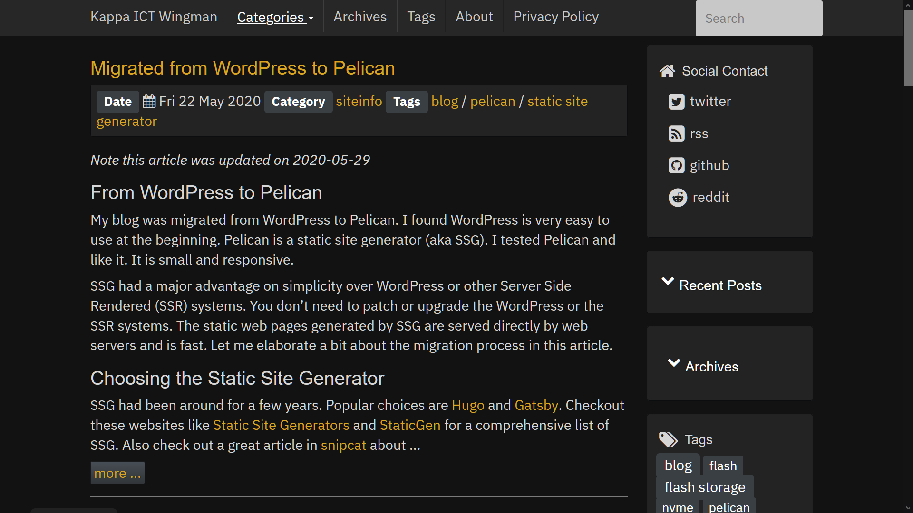

# pelican-bootstrap3-nero

Pelican-bootstrap3 is a Bootstrap 3 theme for Pelican, originally developed by [DandyDev] (https://github.com/DandyDev). It's fully responsive and contains sub-themes from the Bootswatch project. Pelican-bootstrap3 is compatible with Pelican 3.3.0 and higher.

Pelican-bootstrap3-nero is forked from pelican-bootstrap3 and customized. It is a dark theme.

## Usage

All the parameters used by pelican-bootstrap3 are still usable.

We have new settings specific to this theme, also check CHANGELOG.rst

* Setup Cookie Consent 2
	* COOKIE_CONSENT2 = True
	* Set your URL to privacy policy with COOKIE_CONSENT2_PRIVACY_URL
* Setup your account id from IntenseDebate
	* INTENSEDEBATE_ACCOUNT = 'Your account id from IntenseDebate'
* Enable Google Analytics only if Cookie Consent 2 was consented and accepted
	* GOOGLE_ANALYTICS_UNIVERSAL_CHECK_CONSENT = True
	* Also need to configure parameters according to your setting
	* GOOGLE_ANALYTICS_UNIVERSAL = 'UA-XXXXXX-Y'
	* GOOGLE_ANALYTICS_UNIVERSAL_PROPERTY = 'auto'
* Options for sidebar bottom
	* OPTIONAL_SIDEBAR_BOTTOM = True
	* OPTIONAL_SIDEBAR_BOTTOM_TITLE = 'Disclaimer'
	* OPTIONAL_SIDEBAR_BOTTOM_ID= 'disclaimer'
	* OPTIONAL_SIDEBAR_BOTTOM_TEXT = 'Replace by your text for disclaimer'
* Display at bottom of articles. If you have ad-block software it may not be displayed
	Enable it in pelicanconf.py, TWITTER_CUSTOM = True
* JSON-LD
	* JSON_LD = True
	* Based on existing work from https://github.com/alexandrevicenzi/Flex . Thanks to Alexandre.
	* Based on existing work from https://github.com/emoji-gen/blog/blob/master/theme/templates/includes/article_structured-data.html Thanks to Emoj-Gen and Pine.
	* For base / includes/json_ld.html;
	* If enabled, there would be JSON-LD blocks for
	* Type Blog for all html
	* Type Articles for all articles
* JSON-LD, article image and publisher logo are required by Google schema checking
	* SITE_LOGO = 'images/your-image.jpg'
	* PUBLISHER_LOGO = 'images/your-image.jpg'
* JSON_LD_BREADCRUMBLIST = True
	* If both JSON_LD is also enabled:
	* Add type BreadcrumbList for all html

## Screenshot

